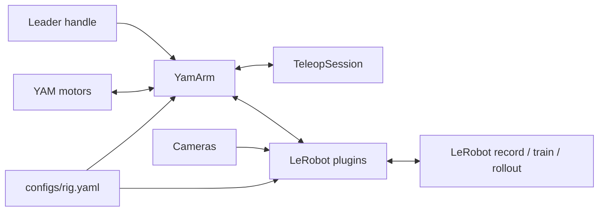

# Control YAM arms, end to end

yamkit connects I2RT YAM leader and follower arms to repeatable SocketCAN setup, guarded teleoperation, LeRobot datasets, and policy rollout.

[Install yamkit](getting-started/installation.md){ .md-button .md-button--primary }
[Understand the system](reference/architecture.md){ .md-button }

!!! danger "Treat every connection as motor activation"

    Only `yamkit can`, `yamkit discover`, and `yamkit policy-check` are designed not to energize motors. Read [Safety](operations/safety.md) before using other commands on hardware.

## Choose a path

-   :material-package-down: **Set up a machine**

    Install the project-local Python environment, bring up CAN, and validate the system.

    [Installation →](getting-started/installation.md)

-   :material-robot-industrial: **Operate the arms**

    Identify physical arms, calibrate grippers, store rest poses, and run teleoperation.

    [Configure a rig →](getting-started/rig-setup.md)

-   :material-database-arrow-right: **Use LeRobot**

    Record datasets, inspect them, train a policy on a GPU host, and deploy a rollout.

    [LeRobot workflows →](operations/lerobot.md)

-   :material-api: **Build an integration**

    Use `RigConfig`, `YamArm`, and the installed LeRobot robot and teleoperator plugins.

    [Working with the API →](reference/api.md)

## What yamkit owns

yamkit is the YAM-specific layer. It owns hardware identity, safe position-command clamping, leader–follower pairing, and the adapter code required by LeRobot. I2RT remains the hardware SDK; LeRobot remains the dataset, camera, training, and rollout framework.

The repository is intentionally self-contained: its managed interpreter, environment, caches, datasets, checkpoints, and vendored I2RT source live below the repository root.
