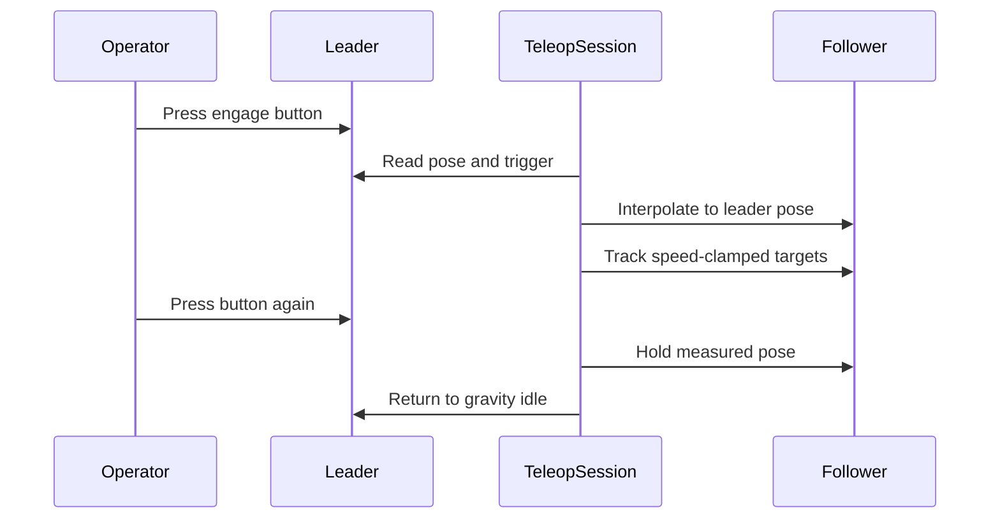

# Teleoperation

yamkit provides a direct control loop and a LeRobot-managed loop. Both use the same rig and `YamArm` hardware boundary.

## Direct yamkit loop

Start all configured pairs and engage each with the top button on its teaching handle:

```bash
yamkit teleop
```

The engagement sequence is:



Restrict a run to one pair while commissioning:

```bash
yamkit teleop --pair left_follower
```

Useful runtime overrides:

```bash
yamkit teleop --pair left_follower --auto-engage --duration 20
yamkit teleop --hz 100 --bilateral-kp 0.15
```

`--auto-engage` starts the synchronization move immediately. Use it only when both poses and the workspace are already verified.

## LeRobot loop

Use LeRobot's teleoperation runner when validating the exact plugin path used for recording:

```bash
yamkit teleoperate --arms left --fps 60
```

With no `--arms`, the wrapper selects all configured pairs. One pair uses the `yam_follower` and `yam_leader` plugins; two pairs use their `bi_yam_*` variants.

Inspect the delegated command without executing it:

```bash
yamkit teleoperate --arms left --dry-run
```

Unknown options are passed through to `lerobot-teleoperate`, so use `--flag=value` syntax for delegated options.

## Stop behavior

On `Ctrl-C`, direct teleoperation disengages active pairs, leaves followers holding, returns leaders to gravity compensation, and closes the arms. The firmware timeout remains the final protection if command traffic stops unexpectedly.
