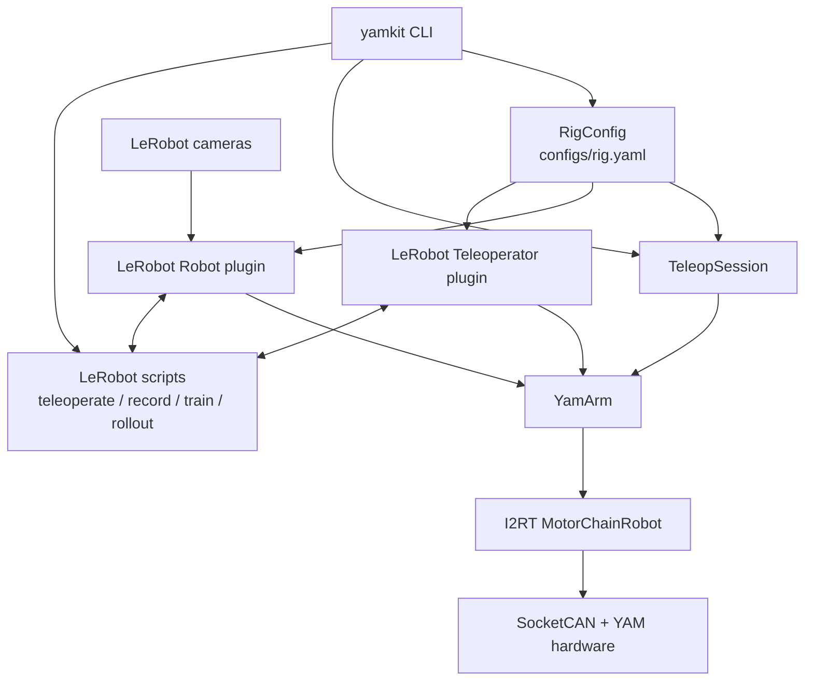

# Architecture

yamkit is a small integration layer between physical YAM hardware, the vendored I2RT SDK, and LeRobot.

## Layers

### Configuration and discovery

`yamkit.config` parses and validates `configs/rig.yaml`. `yamkit.can` discovers SocketCAN interfaces and maps USB metadata. `yamkit.discovery` passively reads device registers to propose arm classifications and rig entries.

Adapter serials, rather than ephemeral `can0` names, are the preferred identity. `resolve_channel()` maps a configured serial to the current SocketCAN interface at connection time.

### Hardware boundary

`yamkit.arm.YamArm` is the only yamkit abstraction that talks to I2RT's `MotorChainRobot`. It normalizes state to six joint positions, velocities, efforts, an optional `0..1` gripper value, and optional handle buttons.

All follower action paths converge on `YamArm.command()`, which clips the gripper and rate-limits changes based on configured maximum speeds. Do not create a second hardware or control abstraction.

### Direct teleoperation

`yamkit.teleop.TeleopSession` owns one or more `TeleopPair` objects. It reads leader and follower state, handles button-edge engagement, interpolates the initial follower synchronization, optionally applies bilateral leader gains, and shuts down both sides.

### LeRobot integration

The two workspace packages under `plugins/` register four types:

- `YamFollower` and `BiYamFollower` implement LeRobot's `Robot` interface;
- `YamLeader` and `BiYamLeader` implement LeRobot's `Teleoperator` interface.

The plugins translate feature dictionaries but delegate hardware access to `YamArm`. Camera construction and dataset, training, visualization, and rollout behavior stay in LeRobot.

## Data flow

| Flow | Input | Output |
| --- | --- | --- |
| Direct teleop | leader joint/trigger state | speed-clamped follower position targets |
| Recording | leader action + follower state + camera frames | LeRobot v3 dataset under `data/datasets/` |
| Training | LeRobot dataset | checkpoint under `outputs/train/` |
| Rollout | follower state + camera frames + language task | policy action through the follower plugin and `YamArm.command()` |

## I2RT relationship

`third_party/i2rt` is a pinned editable dependency. I2RT provides CAN motor drivers, gravity compensation, robot construction, models, and teaching-handle access. Its exact upstream revision and local patch are recorded in `third_party/i2rt.VERSION`.

Changes to the vendor tree are not ordinary yamkit refactors: preserve the patch ledger and validate both yamkit's vendor-patch guard and the relevant I2RT tests.
