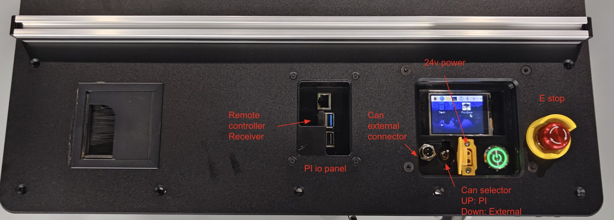
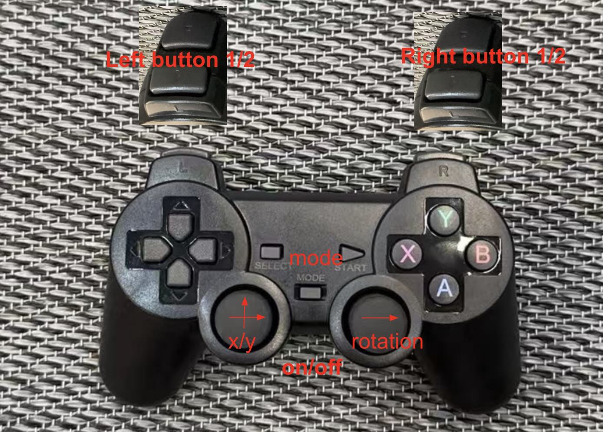
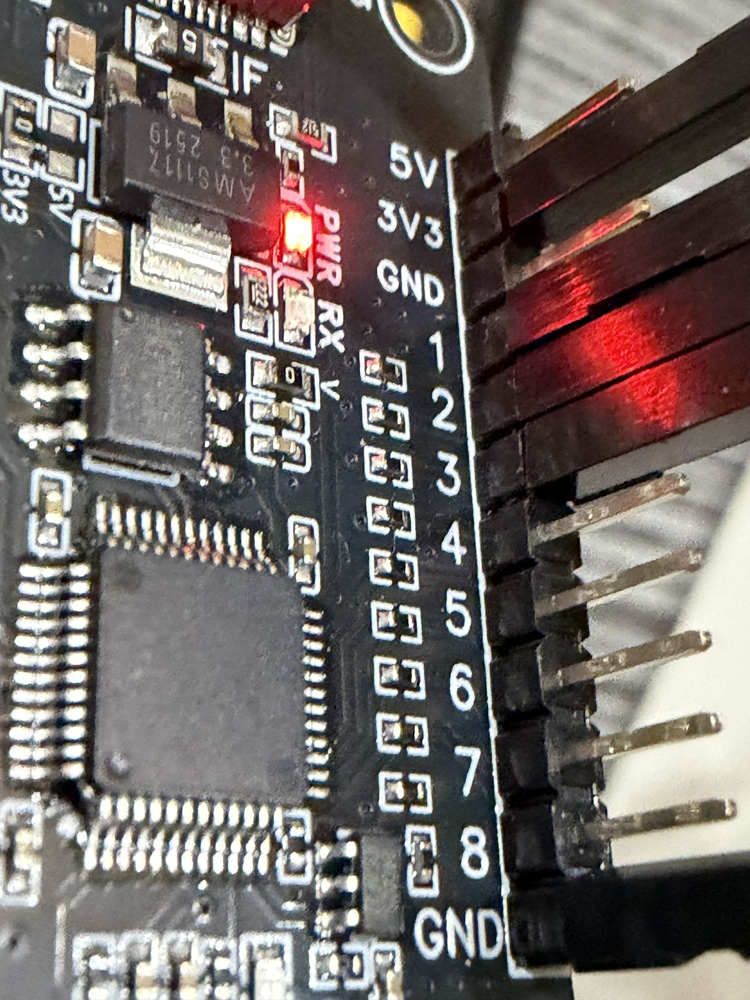
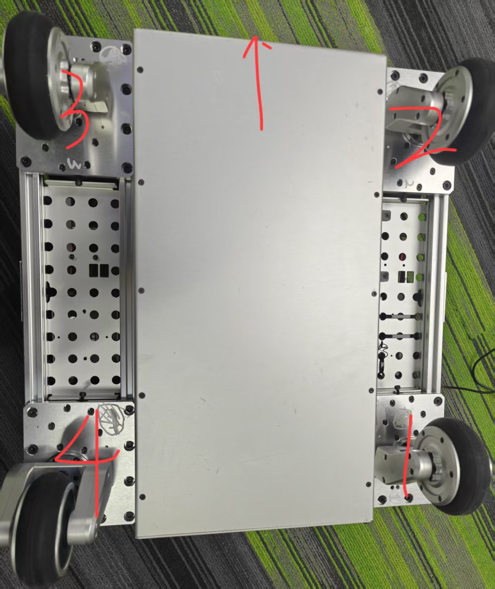
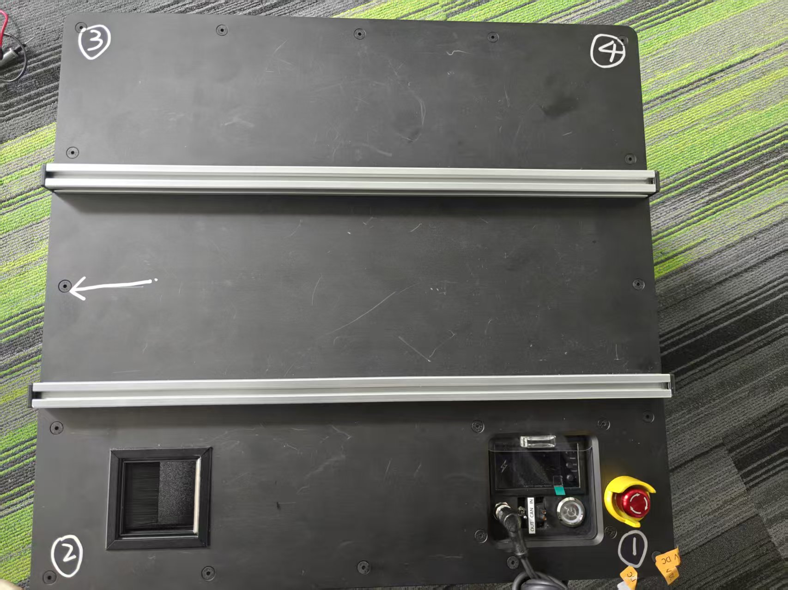
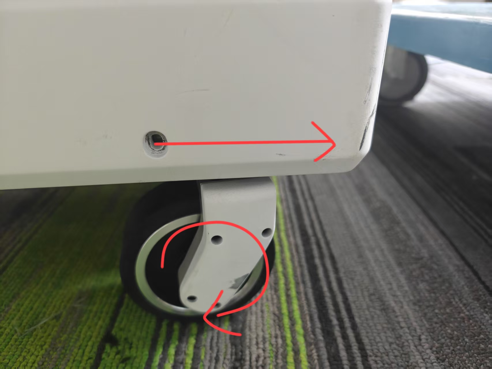
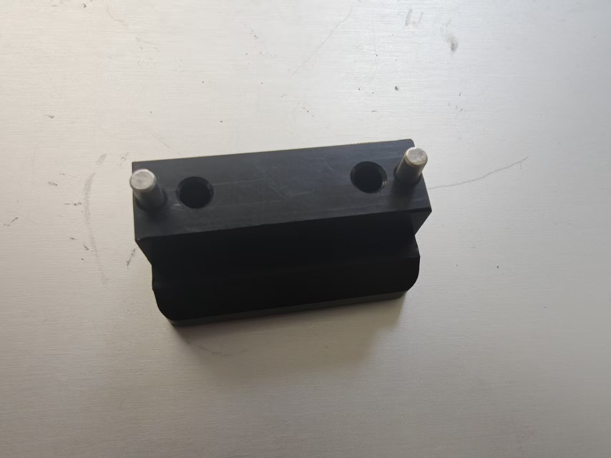

# Flow Base Setup Guide

## Important Notes

⚠️ **Software Updates**: The pre-installed software may be outdated. To access the latest features, log into the base and pull the newest i2rt codebase.

⚠️ **Pi Firmware**: Latest pi firmware is available [here](https://drive.google.com/drive/u/3/folders/1BAvdCFFR2lsmHqKH9YQ_lMbPV0TAIKik?dmr=1&ec=wgc-drive-globalnav-goto) under the PI_firmware folder. If your device doesn't have all necessary settings configured, remove the SD card and burn the latest firmware following [this instruction](../../devices/pi_setup.md).

## Getting Started

### Unboxing

Follow the detailed visual documentation provided in this [unboxing guide](https://www.canva.com/design/DAGvHpqzf-Y/C_ESTYVeHzDPKgkTQZTf0w/view?utm_content=DAGvHpqzf-Y&utm_campaign=designshare&utm_medium=link2&utm_source=uniquelinks&utlId=h74da76f842). Ensure the battery and charging port are connected correctly.

### Initial Setup

1. Install the battery and turn on the base
2. The screen will light up and the Raspberry Pi will begin booting
3. Verify the **E-stop** is **not pressed**
4. Ensure the **CAN bus selection switch** is in the **IN position**

<p align="center">
  
</p>

⚠️ **Note**: The small screen firmware may cause slower Pi boot times, but you can SSH into the system quickly once it's ready.

### Quick Start

1. Double-click the **FlowBase** icon on the desktop and run it in terminal
2. Turn on the remote to control the base
3. If the remote is unresponsive, toggle it off and on to wake it from sleep mode

## System Access

### Pi Login Credentials
- **Username**: `i2rt`
- **Password**: `root`

### SSH Access

**Option 1: Wireless Connection**
Connect the Pi to your local network via Wi-Fi (keyboard required for password entry).

**Option 2: Wired Connection**
The exposed RJ45 network interface is preconfigured with static IP `172.6.2.20`.

1. Connect your dev machine to the wired port with an ethernet cable
2. Configure your dev machine's network interface to use `172.6.2.*` IP range
3. SSH using:
   ```bash
   ssh i2rt@172.6.2.20 -J $USER_NAME@$YOUR_DEV_MACHINE_IP
   ```

## Remote Control

<p align="center">
  
</p>

### Control Layout

- **Left joystick**: Translation (XY movement)
- **Right joystick X-axis**: Rotation
- **Right joystick Y-axis**: Linear rail lift (up/down) - only available when linear rail is installed
- **Left1**: Reset odometry
- **Mode**: Switch between local and global coordinate modes
- **Left2**: Override API commands (safety feature)

### Important Notes
- The base has motion control limits with maximum acceleration constraints
- When you release the joystick (sending 0 command), the base won't stop immediately due to physics
- Always ensure the remote is awake when running API experiments - Left2 can override unexpected code behavior
- Speed and acceleration settings can be adjusted in [flow_base_controller](flow_base_controller.py#L912-L913)

⚠️ **Warning**: Setting overly aggressive speed or acceleration parameters can cause system instability.

## Coordinate Systems

### Local vs Global Mode

⚠️ **Odometry Warning**: Wheel odometry is prone to error accumulation and can be inaccurate. For mobile manipulation requiring precise odometry, integrate visual odometry sensors like RealSense T265 or ZED Camera.

- **Global mode**: Similar to drone headless mode, but wheel odometry errors accumulate
- **Local mode**: Relative to current base orientation
- Press **Mode** button to switch between coordinate systems
- Press **Left1** to reset odometry
- Base screen displays current command: `frame: global cmd: 0.0 0.0 0.0`

## API Control

### Network Setup
1. Connect base to Wi-Fi or use wired connection
2. Base IP address: `172.6.2.20`
3. Verify connectivity: `ping 172.6.2.20`

### Basic Commands

**Read Odometry:**
```python
python i2rt/flow_base/flow_base_client.py --command get_odometry --host 172.6.2.20
```

**Output:**
```bash
[Client] Connecting to 172.6.2.20:11323
[Client] Connection established
{
  'position': {'translation': array([-6.59e-07, -3.79e-04, 0.0]), 'rotation': array(-0.00022068)},
  'velocity': {
    'world': {'translation': array([0.0, 0.0, 0.0]), 'rotation': 0.0},
    'body':  {'translation': array([0.0, 0.0, 0.0]), 'rotation': 0.0},
  },
}
```

`position` is in the world frame (meters, radians). `translation` is a 3-D vector `[x, y, z]` — `x`/`y` come from wheel odometry, and `z` is the linear-rail height in meters when the rail is enabled (`0.0` otherwise). `velocity` is reported in both the world frame (`velocity.world`) and the base body frame (`velocity.body`) — pick whichever is convenient. `translation` is m/s, `rotation` is rad/s; the rail axis is vertical so `vz` is identical in world and body frames, and angular velocity is identical in both frames as well (the base only rotates about z).

**Reset Odometry:**
```python
python i2rt/flow_base/flow_base_client.py --command reset_odometry --host 172.6.2.20
```

**Test Movement** ⚠️ **Base will move**:
```python
python i2rt/flow_base/flow_base_client.py --command test_command --host 172.6.2.20
```

**Test Linear Rail** ⚠️ **Linear rail will move**:
```bash
python i2rt/flow_base/flow_base_client.py --command test_linear_rail --host 172.6.2.20
```

**Get Linear Rail State**:
```bash
python i2rt/flow_base/flow_base_client.py --command get_linear_rail_state --host 172.6.2.20
```

**Get Combined Observation** (odometry + wheel states, plus linear rail when `--with-linear-rail` is set):
```bash
# Odometry + wheel states
python i2rt/flow_base/flow_base_client.py --command get_observation --host 172.6.2.20

# Odometry + wheel states + linear rail
python i2rt/flow_base/flow_base_client.py --command get_observation --host 172.6.2.20 --with-linear-rail
```

**Output (with `--with-linear-rail`):**
```python
{
  'odometry':     { ... same shape as get_odometry ... },
  'wheel_states': { ... same shape as get_wheel_states ... },
  'linear_rail':  { ... same shape as get_linear_rail_state ... },
}
```
Without the flag, the `linear_rail` key is omitted; `odometry` and `wheel_states` are always returned.

**Get Wheel States** (per-motor pos/vel/torque for the 8 base motors):
```bash
python i2rt/flow_base/flow_base_client.py --command get_wheel_states --host 172.6.2.20
```

**`get_wheel_states()` output:**
```python
{
  'steer': {'pos': array([..4]), 'vel': array([..4]), 'eff': array([..4])},  # rad, rad/s, Nm
  'drive': {'pos': array([..4]), 'vel': array([..4]), 'eff': array([..4])},  # rad, rad/s, Nm
}
```
`eff` is motor torque in Nm. The 4 entries per group are the casters in chain order; the linear
rail (9th) motor is reported separately by `get_linear_rail_state()`.

Chain order matches the physical motor-ID wiring (steer, drive) → caster:

| Index | Motors (steer, drive) | Caster |
|-------|-----------------------|--------|
| 0 | 1, 2 | rear-left |
| 1 | 3, 4 | front-left |
| 2 | 5, 6 | front-right |
| 3 | 7, 8 | rear-right |

### Linear Rail API (if equipped)

If your FlowBase has a linear rail lift module installed, you can control it via API:

**Available Methods:**
- `get_linear_rail_state()` - Get position, velocity, limit-switch and calibration state
- `set_linear_rail_velocity(velocity)` - Set linear velocity in m/s (positive = up; converted to motor rad/s server-side using the calibrated `meters_per_rad`)
- `set_target_velocity([x, y, theta, rail_vel], frame)` - Combined base + rail control (4D; `rail_vel` in m/s)
- `get_observation()` - Returns `{odometry, wheel_states, linear_rail}` (the `linear_rail` key is included only when `with_linear_rail=True`)

Initialize with `FlowBaseClient(host="172.6.2.20", with_linear_rail=True)` to enable linear rail support.

The client clips every command axis to a configurable symmetric limit before sending:
`FlowBaseClient(..., max_vel_x=..., max_vel_y=..., max_vel_theta=..., max_vel_z=...)` —
`max_vel_x/y/z` in m/s, `max_vel_theta` in rad/s. Defaults are `0.5 / 0.5 / π/2 / 0.5`,
hard caps `1.0 / 1.0 / π / 1.0` (values outside `(0, cap]` raise `ValueError`).

**`get_linear_rail_state()` output:**
```python
{
  'position': {'motor': 0.314, 'linear': 0.050},   # rad, m
  'velocity': {'motor': -1.40, 'linear': -0.222},  # rad/s, m/s
  'eff': 0.85,                                      # Nm, rail motor torque
  'upper_limit_triggered': False,
  'lower_limit_triggered': False,
  'brake_on': False,
  'initialized': True,
  'meters_per_rad': 0.159,                          # m/rad, signed
}
```
`position.motor` / `velocity.motor` are the raw motor encoder readings (rad, rad/s). `position.linear` / `velocity.linear` are the corresponding linear quantities in m / m/s, derived from `meters_per_rad` captured at startup. Both are `None` until the rail has been calibrated.

**Startup calibration:**
- The rail drives up to the upper limit switch, captures the motor angle, then drives down to the lower limit switch and captures the motor angle again.
- `meters_per_rad = total_stroke_m / (theta_upper - theta_lower)`, where `total_stroke_m` is the physical stroke between the two limits (default `1.0` m, configurable via `LinearRailVehicle(total_stroke_m=...)`).
- The encoder is then zeroed at the lower limit, so `position.motor = 0` and `position.linear = 0` at the bottom of travel.
- If either move times out (default 30 s) or `|theta_upper − theta_lower|` is too small to calibrate, initialization raises `RuntimeError` and the vehicle aborts rather than running uncalibrated.

**Important Notes:**
- API velocity commands are physical units: `x`/`y`/`rail_vel` in m/s, `theta` in rad/s. The server converts the rail command to motor rad/s using the calibrated `meters_per_rad`; only the gamepad's normalized sticks are scaled by the server's `max_vel` / `lift_max_vel_ms`. Homing speed remains motor rad/s.
- Linear rail homes top-then-bottom and calibrates `meters_per_rad` on initialization
- Linear rail has limit switches that prevent movement beyond safe range
- Velocity commands timeout after 0.25s of inactivity (safety feature)
- Brake is automatically managed by the system (released on init, engaged on shutdown)
- To stop the rail, set velocity to 0.0 instead of controlling brake directly

### Safety Features
- API command timeout prevents runaway behavior (base: 0.25s, linear rail: 0.25s)
- FlowBaseClient automatically maintains command heartbeat
- Base and linear rail stop automatically when client disconnects
- Use remote Left2 to override API commands in emergencies
- Use remote Left1 to clear odometry during testing
- Linear rail limit switches provide hardware safety stops
- Steering motors are checked while moving; a stalled or non-responding one ramps the base to a stop and exits (see [Runtime steering-motor check](#runtime-steering-motor-check))

## External Control

To control the base without the built-in Raspberry Pi:

1. Connect your external CAN device to the CAN external connector
2. Set the CAN selector switch to the **OUT position**
3. Clone the i2rt repository on your external computer
4. Install the udev rules so the CAN interface is auto-configured on connect:
   ```bash
   sudo devices/install_devices.sh
   ```
   This installs `devices/rules/flow_base.rules` into `/etc/udev/rules.d/`, which loads the `gs_usb` driver and brings the CAN interface up at 1 Mbit/s.
5. Control the base directly through your external system

### Linear Rail on x86 / non-Pi hosts (USB-GPIO converter)

On the built-in Raspberry Pi the linear rail's brake and limit switches use the Pi's native GPIO — no setup required. On an x86 / non-Pi host they are driven through a **bestep USB-to-16-channel GPIO converter** (hardware id `ZT-DPI/SY`) on a serial port. The backend is auto-selected from `platform.machine()`, so the control code is identical on both platforms.

<p align="center">
  
</p>

- `--device` is required on an x86 / non-Pi host whenever `--linear-rail` is set; on the Raspberry Pi it is not needed (native GPIO) and is ignored, e.g.
  ```bash
  python i2rt/flow_base/flow_base_controller.py --linear-rail --device /dev/ttyUSB0
  ```
  (The `I2RT_USB_GPIO_PORT` env var also works for programmatic use; the flag wins.)
- Converter channel wiring: **channel 1 = upper limit switch, channel 2 = lower limit switch, channel 3 = brake**.
- Requires `pyserial` (installed with the package).

Wiring (the `BCM N` are the controller's logical pins, mapped to converter channels by `USB_GPIO_CHANNEL_MAP`):

```text
x86 host --[USB 115200 8N1]--> bestep USB-to-16ch GPIO converter (ZT-DPI/SY),
                               enumerates as /dev/ttyUSB0
                               |
                               +-- 3.3V --> upper/lower limit switches (common)
                               +-- ch1  --> upper limit switch   (BCM 5)
                               +-- ch2  --> lower limit switch   (BCM 6)
                               +-- ch3  --> brake control signal (BCM 12)
                               +-- GND  --> brake driver GND
```

## Commissioning & Calibration

> One-time hardware bring-up for a **new base** (or after replacing a motor, wheel, or caster). A base shipped from the factory is already commissioned — you only need this if you built/repaired the drivetrain or the base fails the functional checks below. All commands assume the CAN interface is `can0`.

### 1. Motor IDs & Parameters

Each of the four casters has two Damiao (DM) motors — a **steering** motor and a **drive** motor. Whatever the drive motor's part number on a given unit, the controller builds it as `DM_FLOW_WHEEL`, so its firmware registers must hold the same π / 30 / 10 as the steering motors; see the table below. The eight motors use CAN IDs **1–8**; the ID → caster mapping is the *Chain order* table in [API Control](#api-control) (steering = odd IDs 1/3/5/7, drive = even IDs 2/4/6/8). Identify each motor's caster and number from the physical layout:

<p align="center">
  
  
</p>

Configuration rules:
- **Master ID = CAN ID + 16** (DM protocol), so IDs 1–8 map to Master IDs 17–24.
- All motors run in **speed (velocity) mode** (`CTRL_MODE` = 3).
- Target per-motor register values:

  | Register | Steering (1/3/5/7, DM4310V) | Drive (2/4/6/8, DM_FLOW_WHEEL) | Rail (9, DM8009) | Checked at startup |
  |----------|------------------------------|--------------------------------|------------------|--------------------|
  | `Gr` (gear ratio) | 10 | 10 | 9 | ✅ **yes — read-only; any mismatch blocks the launch** (`verify_motor_types`) |
  | `CTRL_MODE` | 3 (speed) | 3 (speed) | 3 (speed) | ✅ **yes — repaired and saved** |
  | `PMAX` / `VMAX` / `TMAX` | π (≈3.1415926) rad / 30 rad/s / 10 Nm | π (≈3.1415926) rad / 30 rad/s / 10 Nm | 12.5 rad / 45 rad/s / 54 Nm | ✅ **yes — read-only.** A wrong `PMAX`/`VMAX` on a steering motor blocks the launch; everything else — the same registers on a drive or rail motor, and `TMAX` on any motor — logs an ERROR and the base starts |

  `Gr` is the **gear reduction ratio**, and it is the one register that identifies a motor: it is
  read-only, so unlike `PMAX`/`VMAX`/`TMAX` it cannot be misconfigured on a correct motor or set to
  flatter a wrong one. It is checked by `verify_motor_types`, which the chain runs *before* the
  control-mode and scaling pass — deliberately, because on the wrong part those three registers hold that
  part's own scale, so checking type first is what stops the rows below from advising a `PMAX` rewrite, or
  writing `CTRL_MODE` to Flash, on a motor whose repair is to be swapped. All three columns were **read
  off hardware** (2026-08-18, `can_flowbase`: motors
  1/3/7 steering, 2/4/6/8 drive, 9 rail; the rail's 9 also reproduces a 2026-08-14 reading on a
  different base). A mismatch blocks the launch on *every* motor, with none of the severity split the
  scaling rows get, because it is not a setting that could be repaired — it means the wrong part is
  bolted in, and the swerve model folds no gear ratio in anywhere (`N_s`/`N_r1`/`N_r2`/`N_w` are all 1
  in `flow_base_controller.py`, i.e. the motor's own rad/s is taken as the wheel's).

  > ⚠️ **`Gr` cannot tell a steering motor from a drive motor.** Both are 10:1, so a caster whose two
  > motors are swapped passes this check. What it does catch is the wrong *class* of motor in a slot — a
  > `DM4340` reads 40, a `DM6248` 48, a `DM8009` 9. A wrong steering zero or `STEERING_DIRECTION` is
  > likewise invisible to it; those are the caster steering check's business, and the section below's.

  > ⚠️ **`DM_FLOW_WHEEL` is a role, not a part number.** The drive motor's part number may differ per
  > unit, and `Gr` being read-only means it cannot be normalised across units the way the scaling
  > registers are. It is asserted at 10 anyway, so a base built with a different drive motor refuses to
  > start rather than driving mis-scaled — which is the intended way to find out such a unit exists. If
  > one turns up, read its `Gr` and widen `_GEAR_RATIO` in
  > [`motor_drivers/utils.py`](../motor_drivers/utils.py); `--no-verify-motor-config` is the field bypass,
  > and it turns off the type check and the control-mode/scaling check together.

  > ⚠️ **The rail motor is a different type and holds different numbers.** The check derives every
  > expectation per motor from `MotorType.get_motor_constants`, so it compares motor 9 against
  > `DM8009`'s 12.5 / 45 / 54 and never against the π / 30 / 10 the base motors want. Surveying a
  > fleet by hand, do the same: diffing motor 9 against the steering column reports a triple mismatch
  > on a perfectly healthy rail.

  `PMAX`/`VMAX`/`TMAX` are not free parameters on any motor — they must equal
  `MotorType.get_motor_constants(<type>)` in [`motor_drivers/utils.py`](../motor_drivers/utils.py),
  because that is what `dm_driver` *decodes their feedback with* — position through `PMAX`, velocity
  through `VMAX`, torque through `TMAX` — and a firmware register that disagrees rescales every reading
  with no error anywhere. They do **not** encode the commands: the only encode path that uses them is
  the MIT branch of `set_control`, and both Flow Base chains are built with `ControlMode.VEL`, whose
  frame carries a raw float32 rad/s and no scaling at all. Both Flow Base motor types resolve to
  the same π / 30 / 10, and both were **confirmed on hardware** (2026-08-14, motors 1 and 2 of
  `can_flowbase`), which is what settles the drive-motor question this table used to carry a warning
  about. The rail column is **confirmed on hardware** too (2026-08-14, motor 9 of `can_flowbase`):
  motor 9 is a `DM8009` and holds 12.5 / 45 / 54 with `CTRL_MODE` already 3, so the startup check finds
  nothing to repair there either.

  The loop gains (`KP_ASR`/`KI_ASR`, `KP_APR`/`KI_APR`) are deliberately **not** listed here. No check
  reads or writes them, the bases run on whatever their motors hold, and the values this table used to
  give did not match either of the two motors that have since been read — so a target column nothing
  verifies was worse than no column at all. Read the current values with
  `dm_motor_registers.py read-all` if you need them.

  The startup check **reads** the three scaling registers and never writes them: their correct value
  describes the physical motor rather than being a number the software gets to pick, and a guess written
  to Flash is how a mis-scaled base becomes a permanently mis-scaled one. Fix a mismatch by hand with
  `dm_motor_registers.py write` followed by `save`. The severity split follows the blast radius of the
  *register*, not just of the motor: on a steering motor `PMAX` is the wheel angle the swerve kinematics
  are rebuilt from and `VMAX` is the velocity the odometry integrates, the caster-flip brake trips on and
  the caster fault check judges, so either one aborts the launch. The same two on a drive or rail motor
  only mis-scale the reported translational odometry, and `TMAX` mis-scales only `MotorInfo.eff` — a
  number `get_wheel_states` and the rail state publish and nothing in the loop reads — so those are
  logged and the base starts.

  > ⚠️ **`DMH6215MIT` is a different motor.** It is the one `get_motor_constants` entry at
  > 12.5 / 45 / 10, and an earlier version of this table quoted those numbers for the drive motors. A
  > bench read has since confirmed the drive motors really do hold π / 30 / 10, so those numbers were a
  > documentation error rather than a hardware one — but a motor reading 12.5 / 45 has been configured
  > as the wrong type, and every distance the base reports is mis-scaled until it is fixed. Confirm with
  > `python i2rt/motor_config_tool/dm_motor_registers.py read-all --motor-id 2 --channel can0`.

IDs are set with the **Damiao motor host tool** (上位机); this repository does not ship the interactive
ID-config CLI. Every other register here can be read and written with
[`motor_config_tool/dm_motor_registers.py`](../motor_config_tool/dm_motor_registers.py) — see
[`dm_motor_registers.md`](../motor_config_tool/dm_motor_registers.md) for the register reference and the
operating procedures. Register access needs an **idle bus**, so stop the base controller first.

#### Startup motor-configuration check

`flow_base_controller` checks **every** motor's type, control mode and feedback scaling on each launch,
before it opens the motor chain — there is no later opportunity, because `DMChainCanInterface` claims the
bus for its control loop as soon as it is constructed. It is that constructor that runs them, from
`check_motor_types=True` and `check_motor_config=True`; both live in
[`motor_drivers/motor_check.py`](../motor_drivers/motor_check.py) and are shared with the arms, which run
both as well — more strictly, since a MIT chain that names no loop-critical subset can be refused over any
of the three scaling registers on any motor. Eight register reads per motor — three for the type check (`Gr`, `hw_ver`, `sw_ver`),
five for the config check — roughly 0.7 s for a healthy eight-motor bus.

The control-mode half exists because a wrong `CTRL_MODE` fails in a way that points at the wrong
component: `_motor_on` enables a motor over the raw-id frame, which is answered in any mode, so the chain
builds cleanly and it is the first speed-mode command that goes unanswered — surfacing as
`Motor interface is not running ... check the E stop or the motor connection`.

- **A motor not in speed mode is warned about, written, verified with an independent read-back, and then
  saved to Flash** — so it is fixed permanently and the next launch finds nothing to do. This applies to
  steering, drive and rail motors alike: the chain commands all of them with `ControlMode.VEL`.
- **`PMAX`/`VMAX`/`TMAX` are compared and reported, never written.** A steering motor whose `PMAX` or
  `VMAX` disagrees aborts the launch — those two decode the angle and the rate the base steers and
  navigates on. Everything else logs an ERROR and the base starts: those registers on a drive or rail
  motor, and `TMAX` on any motor, which only scales the torque the base reports. See the table above.

  Both halves of that policy are arguments the controller passes, because the check is shared with the
  arms and cannot infer either. `STEER_MOTOR_IDS` in
  [`flow_base_controller.py`](flow_base_controller.py) is `loop_critical_motor_ids` — the four motors
  whose feedback the swerve loop acts on, and so the only ones that can abort a launch. `ControlMode.VEL`
  is what makes `TMAX` non-blocking: a `VEL` frame carries a raw float32 rad/s and encodes nothing through
  `TMAX`. On an arm, which is MIT, the same register encodes commanded torque and *does* block.
- **Nothing is written unless every motor answered.** A silent motor, or a bus another process is using,
  aborts the launch without touching anything. Likewise nothing is written if a steering motor's `PMAX`
  or `VMAX` is mis-scaled: a bus whose scaling the base will not move on is not one to commit Flash
  writes on. A mismatch that does not block — a drive or rail motor's, or any `TMAX` — never suppressed
  the control-mode repair, and still does not.
- **The first repair that does not stick stops the rest.** Same rule, applied to the write phase: if the
  bus dies (or another process claims it) partway through, the motors behind the failure are named as
  *not attempted* rather than written and Flash-saved over a bus that just dropped one write. Fix the
  motor the error names and run again; `save` is the call most likely to false-ack on a contended bus.
- After a repair, **power-cycle that motor** if the base still reports `Motor interface is not running` —
  the mode change may need a reboot to take effect.
- `--no-verify-motor-config` skips the check entirely (it logs a warning saying so). Use it only for
  bench work with motors missing or a busy bus.

This is the only place the scaling registers are checked, and that is deliberate: a firmware register
cannot change while the base is driving, so reading it once at startup is both exact and sufficient,
where inferring a mismatch from motion would need thresholds and a moving base to work with.

**Verify** every motor answers on the bus (reads only — motors briefly energize, no motion command is sent):
```bash
python i2rt/motor_config_tool/ping_motors.py --channel can0            # checks IDs 1–7
python i2rt/motor_config_tool/ping_motors.py --channel can0 --motor_id 8
```
Each responding motor prints its info and is listed under `online motors: [...]`.

### 2. Drive-Motor Direction

Every drive motor must spin the same way for a given base motion. The "forward" rotation convention is defined by the figure below — the straight arrow is the travel direction, the curved arrow is how the wheel turns:

<p align="center">
  
</p>

If a wheel is wired or mounted backwards, the base will creep or veer during the forward check in [§5](#5-functional-verification) — reinstall the motor/wheel or flip its direction.

> **Software cannot check this for you.** A reversed motor is corrected by flipping its `motor_direction`, which the driver applies to the outgoing command *and* the incoming feedback alike — so a wrong direction constant leaves the software frame perfectly self-consistent while the wheel turns the wrong way. The same is true of a wrong steering zero. Only §5, run with your own eyes, catches these.

### 3. Steering-Zero Calibration

**Only the steering motors need zeroing** — their zero must correspond to the wheel pointing straight forward, and all four wheels must end up parallel.

1. With the motors **disabled**, manually rotate each caster so the wheel points straight ahead. Use the alignment-pin fixture to lock the casters square:

   <p align="center">
     
     
   </p>

2. Save the current position as the hardware zero for each steering motor (IDs 1, 3, 5, 7), one at a time:
   ```bash
   python i2rt/motor_config_tool/set_zero.py --channel can0 --motor_id 1
   python i2rt/motor_config_tool/set_zero.py --channel can0 --motor_id 3
   python i2rt/motor_config_tool/set_zero.py --channel can0 --motor_id 5
   python i2rt/motor_config_tool/set_zero.py --channel can0 --motor_id 7
   ```
   Running `set_zero.py` with no `--motor_id` zeroes motors 1–7 (drive motors included) — pass `--motor_id` explicitly to zero the steering motors only.

> ⚠️ **Get this right by hand — no software check will catch a mistake here.** A wrong steering zero is invisible to the [runtime steering-motor check](#runtime-steering-motor-check) by construction; verify it with §5 below.

### 4. Kinematics Parameters

The swerve kinematics constants live in [`flow_base_controller.py`](flow_base_controller.py) — refer to the code rather than re-listing the numbers here:
- Caster hip positions `h_x, h_y` (line ~41), in **motor-chain order** with the body convention **+x forward, +y left**. The sign/order therefore differ from the internal SOP's per-wheel table even though the 0.2 m magnitudes match.
- Caster offset `b_x` / `b_y` and wheel radius `r` (lines ~95–97).
- Per-caster steering calibration `STEERING_OFFSET` / `STEERING_DIRECTION` (lines ~49–50).

Velocity and acceleration limits are already covered under [Remote Control](#remote-control) and [API Control](#api-control) above; the values are configured in `flow_base_controller.py`.

### 5. Functional Verification

> ⚠️ **Invert the base (or raise it so all wheels are off the ground) before running these — the base will try to drive.**

With the base controller running, send each velocity command and confirm the expected motion. The quickest way is the API client, which keeps the command heartbeat alive and clips each axis to its configured `max_vel` (see [API Control](#api-control)):

```python
import time
import numpy as np
from i2rt.flow_base.flow_base_client import FlowBaseClient

client = FlowBaseClient(host="172.6.2.20")   # heartbeat runs in the background
client.set_target_velocity(np.array([1.0, 0.0, 0.0]), frame="local")  # forward
time.sleep(5)
client.set_target_velocity(np.zeros(3), frame="local")                # stop
client.close()
```

| Command `[x, y, θ]` | Expected motion | Common fault → cause |
|---------------------|-----------------|----------------------|
| `[1, 0, 0]` | Wheels straight, base drives **straight forward** | Drives backward → drive direction wrong; veers → steering zero off or geometry error |
| `[0, 0, 1]` | Wheels toe in, base **spins in place** (CCW) | Translates instead → steering zero off; spins the wrong way → steering direction wrong |
| `[0, 1, 0]` | Wheels at 90°, base **strafes** sideways, heading fixed | Heading rotates → steering zero off; angle ≠ 90° → steering zero offset |
| `[1, 1, 0]` | Base moves on a **45° diagonal** | Direction ≠ 45° → x/y drive mismatch or geometry error |
| `[1, 0, 1]` | Forward **and** rotating (spiral) | Only one component present → check the corresponding motor group |

Adjust the vector in the snippet for each row; hold ~5–10 s, then command zero. For continuous manual control instead, use gamepad teleop (see §6).

#### Runtime steering-motor check

While the base is moving, `flow_base_controller` watches the four **steering** motors (IDs 1/3/5/7) and, on a confirmed fault, ramps the base to a stop through the trajectory generator and exits with status 2. See [`caster_steering_check.py`](caster_steering_check.py).

This exists because the base is steered open-loop in position: the controller commands a steer *rate*, and the wheels only reach the right heading because the caster law drives that rate to zero. Nothing compared a measured steering angle against the model, so a steering motor that stalled, jammed or stopped accepting commands raised no error at all — the base simply veered, and the odometry, derived from the same feedback, agreed with it.

Three things are checked. The first two are judged against the *commanded* body twist, never against measured odometry; the third needs no command reference at all, which is the point of it.

| Check | Trips when | Catches |
|-------|-----------|---------|
| **Steer-rate execution** | commanded and measured steer velocity disagree by more than `max(1.0 rad/s, 50%)` for 0.5 s | stall, jam, torque saturation, wrong `CTRL_MODE`, a faulted or disabled driver |
| **Heading convergence** | the measured angle stays >30° from the angle the kinematics demand, for 6 caster time constants (0.5–3 s) | a fork being back-driven under load, a caster that cannot reach its demanded heading |
| **Runaway backstop** | a steering motor reports more than 12.56 rad/s for 1 s — no command reference at all | a motor spinning away, *including* under a bug in the command path itself, which would blind the two checks above |

The backstop shares its threshold with the controller's caster-flip brake on purpose, so there is one number rather than two that can drift apart. A legitimate flip crosses that threshold for under 0.1 s; what separates it from a runaway is the 1 s of *continuous* violation, not the threshold. The brake suspends the other two checks each time it fires — it rewrites the trajectory-generator target they are judged against — but deliberately not the backstop, which reads raw measured velocity and so has no command reference to be disturbed.

> ⚠️ **What this cannot detect.** A **wrong steering zero**, a wrong `STEERING_OFFSET`/`STEERING_DIRECTION`, and a **coupling slipping downstream of the encoder** are invisible to it — permanently, not for want of tuning. `motor_offset` and `motor_direction` are applied symmetrically to the outgoing command and the incoming feedback, and the controller rebuilds its kinematics from the *reported* angle every cycle, so the reported angle converges to the expected one no matter where the wheel is physically pointing. The software frame stays perfectly self-consistent while the wheel points somewhere else. A **mis-scaled `PMAX`/`VMAX` register** hides for a closely related reason — the kinematics are rebuilt from the reported angle, so a position scale factor only slows convergence and no check here sees an error — which is why it is read directly at startup instead; see [Startup motor-configuration check](#startup-motor-configuration-check). **This does not replace the steering-zero calibration in [§3](#3-steering-zero-calibration) or the manual procedure in §5 above**, which remain the only way to catch those.

Two more limits worth knowing: a motor stalled while *already* at the correct angle is not reported (there is nothing to track, and the caster is pointing correctly — it becomes visible the moment the commanded direction changes); and a fault that comes and goes is caught late or not at all, because a single conforming sample clears the timer. That bias is deliberate — a spurious stop at speed is worse than a delayed one.

**On a trip** the log names the caster and its CAN id, prints a per-caster table of measured vs expected, and writes the last two seconds of steering data to `/tmp/caster-fault-<pid>.csv`. Then the base decelerates at the configured `max_accel` (~1.3 s from 1 m/s) rather than dropping to zero velocity, which at speed would be a skid stop on a base that already has one caster misbehaving. The ramp is bounded by a deadline derived from that caller's own `max_vel / max_accel`, so it fits whatever limits were configured; the log says which of the three endings happened — a clean deceleration, the deadline expiring, or the motor chain dying mid-ramp — because only the first is a controlled stop.

> ⚠️ **The casters have no parking brake.** Once the controller exits, nothing holds the base — on a slope it will roll.

If **three or more casters trip at once**, the fault is reported as systemic rather than as several simultaneous mechanical failures. Four mechanically independent casters rarely fail together, so look for what they share — an edit to the kinematic constants `h_x`/`h_y`/`b_x` or to `AXIS_SIGN`, a bug in the command path, one open power or E-stop leg feeding the whole chain, or motors left out of `CTRL_MODE` 3. The register read-back is the cheapest first look:

```bash
python i2rt/motor_config_tool/dm_motor_registers.py read-all --motor-id 1 --channel can0
```

`--no-check-caster-steering` disables the check entirely (it logs a warning saying so). Use it only for bench work, for the same reasons as `--no-verify-motor-config`.

Programs that build a `Vehicle` directly rather than running `flow_base_controller` as a script get the ramp-to-stop but keep running: the control loop exits while the chain stays alive, so `running()` still returns True and the program looks healthy while ignoring every command. Poll `vehicle.caster_fault()` to notice — both `examples/` entry points now do, and are worth copying.

### 6. Gamepad & Controller Run Test

Final check with the real controller:
```bash
python i2rt/flow_base/flow_base_controller.py            # remote / API teleop
python i2rt/flow_base/flow_base_controller.py --gamepad  # wired-gamepad teleop
```
To debug a gamepad's raw axis/button values, run the standalone reader:
```bash
python -m i2rt.utils.gamepad_utils
```
Gamepad notes: set a Logitech pad to **D (DirectInput) mode** before launching, then let the sticks settle — on startup the pad may report residual non-zero values, so wait until the printed axes read ~0 before driving. This wired gamepad is separate from the wireless RC remote in [Remote Control](#remote-control).

The controller should initialize all motors, respond smoothly to input, and move without abnormal vibration or noise. If startup fails, check CAN wiring and re-run the motor verification in §1; if motion is rough or veers, re-check the steering-zero calibration in §3.

## Troubleshooting

- **Remote unresponsive**: Toggle remote off and on to wake from sleep
- **Slow boot**: Screen firmware causes delays, but SSH access is available quickly
- **Inaccurate odometry**: Expected with wheel-based systems, especially during aggressive movements
- **Linear rail not homing**: Check GPIO connections and limit switches. Ensure brake is released. On x86, confirm the USB-GPIO converter is on the path given by `--device` (default `/dev/ttyUSB0`) and that `pyserial` is installed
- **Linear rail stuck at limit**: Check limit switch state. Use `get_linear_rail_state()` to verify switch status
- **`CASTER STEERING FAULT` and the controller exits (status 2)**: a steering motor is not doing what it was told. The message names the caster and its CAN id — check that motor for a mechanical jam, an open power/E-stop leg, and `CTRL_MODE = 3`; the per-caster table and `/tmp/caster-fault-<pid>.csv` show what it was doing. If **three or more** casters are named the fault is reported as systemic — suspect something shared (the command path, the kinematic constants, one power/E-stop leg, `CTRL_MODE`) rather than that many simultaneous mechanical faults. If the wheels are visibly misaligned but the table looks clean, that is a calibration fault the check cannot see — go to [§3](#3-steering-zero-calibration) and §5. `--no-check-caster-steering` disables the check for bench work
- **Controller hangs on Ctrl+C, or the next launch says another instance is running**: fixed — the base controller now stops and closes the CAN chain on exit. If you still see it, a stale `/tmp/base-controller.pid` from an older build may be left over; a hung instance also keeps driving the bus, which makes the next launch's control-mode check fail with "motor did not answer"
